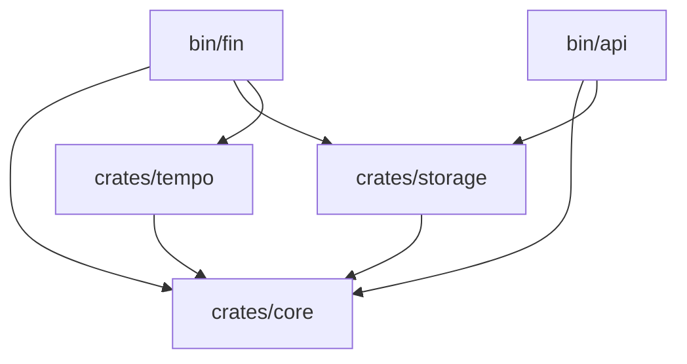

# Package Design

To ensure modularity, compile-time performance, and separation of concerns, the **Tempulse** monorepo is organized into the following workspace members.

## Workspace Structure

```text
.
├── bin/
│   ├── fin/              # [Binary] The Indexer Daemon
│   └── api/              # [Binary] The HTTP API Server
├── crates/
│   ├── core/             # [Lib] Common types, Config, Telemetry
│   ├── storage/          # [Lib] Database entities, SQLx queries, Migrations
│   └── tempo/            # [Lib] Tempo/Alloy bindings, Contract ABIs
└── Cargo.toml            # Workspace Root
```

## Detailed Responsibilities

### 1. `crates/core` (`tempulse-core`)
**Role:** The foundational library used by all other crates.
*   **Configuration:** Global `Settings` struct (loading from `.env` or config files).
*   **Telemetry:** Tracing setup (logs, metrics) to ensure uniform observability across `fin` and `api`.
*   **Error Handling:** Shared `Result` and `Error` types.
*   **Utils:** Date/time helpers, standard formatters.

### 2. `crates/storage` (`tempulse-storage`)
**Role:** The centralized data access layer.
*   **Why separate?** Both `fin` (writer) and `api` (reader) need to access the database. Keeping this separate prevents code duplication and circular dependencies.
*   **Contents:**
    *   `models/`: Rust structs matching DB tables (e.g., `Transfer`, `Token`).
    *   `repos/`: Traits and implementations for DB operations (e.g., `TransferRepository::insert_batch`).
    *   `migrations/`: SQL migration files.
    *   `Pool`: Connection pool management.

### 3. `crates/tempo` (`tempulse-tempo`)
**Role:** The blockchain integration layer.
*   **Why separate?** Isolates `alloy` dependencies and contract compilation. If ABI generation changes, only this crate recompiles.
*   **Contents:**
    *   **ABIs:** `alloy::sol!` macro definitions for `ERC20`, `Factory`, etc.
    *   **Clients:** Helper functions to instantiate Tempo RPC providers.
    *   **Decoders:** Logic to parse raw logs into domain events.

### 4. `bin/fin` (Indexer)
**Role:** The "Writer" service.
*   **Dependencies:** `tempulse-core`, `tempulse-storage`, `tempulse-tempo`.
*   **Responsibilities:**
    *   Startup: Run DB migrations, connect to RPC.
    *   Loop: Poll blocks or listen to WebSocket stream.
    *   Process: Use `tempulse-tempo` to decode events.
    *   Persist: Use `tempulse-storage` to save data.

### 5. `bin/api` (Server)
**Role:** The "Reader" service.
*   **Dependencies:** `tempulse-core`, `tempulse-storage`.
*   **Responsibilities:**
    *   Web Server: Axum/Tokio setup.
    *   Routes: Define endpoints (e.g., `/api/v1/transfers`).
    *   Handlers: Call `tempulse-storage` to fetch data and return JSON.

## Dependency Graph


